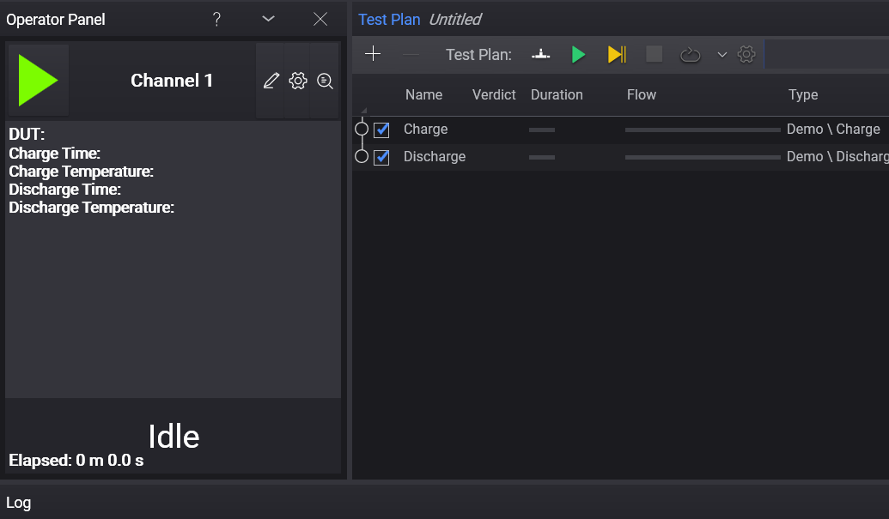

# Operator Panel

The Operator Panel is a user interface plugin for the Test Automation Shell, designed to streamline manufacturing tests.

## Table of Contents

1. Overview
2. Licensing
3. Installation
4. Usage
5. Customization
6. Source code and license

## 1. Overview

Manufacturing environments often require a streamlined and user-friendly experience to increase efficiency and reduce the chance of errors. The Operator Panel provides an intuitive solution, allowing for simultaneous execution of any number of parallel tests. All panels run the same test plan, but each has a separate set of external parameters that are set individually. In 'focus mode', there is no way to modify or affect the test plan run, except for a few intended methods.

The Operator Panel plugin is provided as a basis or example for new panel implementations, but it can also be used as-is.

## 2. Licensing
To use custom panels in Test Automation Shell (Editor.exe), a TAP_Engine license is required.

## 3. Installation

- Install the Operator Panel plugin using the package manager.
- Start Test Automation

## 4. Usage
- The basic panel can be opened from the View menu.

- The operator panel can be docked next to the test plan panel like this:

To make the panel aware of you DUT, parameterize the DUT property unto the test plan.

Results seen in the operator panel are properties from the test plan steps which are marked with the `[Result]` attribute. How to manage this can be seen in the example / demonstration plugin.

## 4.1 Focus Mode

Focus mode minimizes the number of interactions with Test Automation, reducing the likelihood of operators performing unintended actions.

For optimal use of the Operator Panel in a manufacturing setting, follow these steps:

1. Remove all unnecessary panels from the view.
2. Dock the Operator Panel in the center of the user interface.
3. Maximize the window and enter focus mode by pressing the ALT+Shift+Enter keyboard shortcut.
4. Save this preset by pressing CTRL+ALT+Shift+S.

We recommend creating both a 'developer' and an 'operator' preset, which can be easily switched between using the ALT+Shift+[1234] keyboard combination. See the preset menu for details.

## 5. Customization
To create a new panel implementation, use the provided source code as a basis or example.

## 6. Source Code and License
The source code for the Operator Panel is provided under the MIT license.